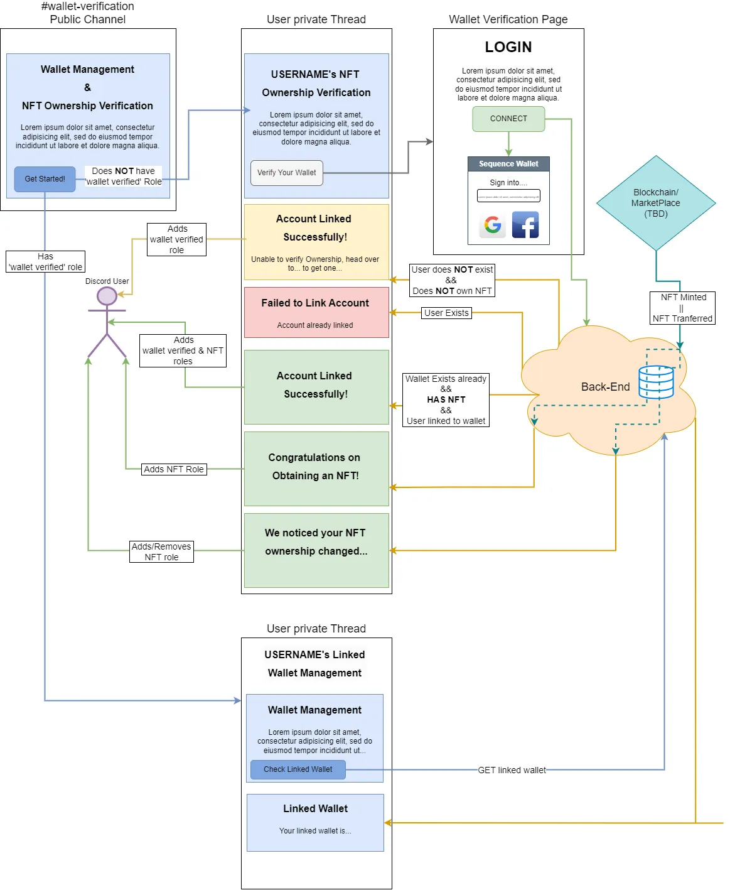

<a id="readme-top"></a>

<br />
<div align="center">
  <a href="https://github.com/0xsequence/discord-verification-bot">
    
  </a>

<h1 align="center">Sequence Wallet Discord Verification Bot</h1>
  <p align="center">
    A Discord Bot for assigning your own server roles to users who link their wallets and verify their NFT ownership.
    <br />
    <a href="https://docs.sequence.xyz/guides/wallet-verification-guide/"><strong>Explore the docs »</strong></a>
    <br />
    <br />
    <a href="https://discord.gg/{TBD}">View Demo</a>
    ·
    <a href="https://github.com/0xsequence/discord-verification-bot/issues/new?labels=bug&template=bug-report---.md">Report Bug</a>
    ·
    <a href="https://github.com/0xsequence/discord-verification-bot/issues/new?labels=enhancement&template=feature-request---.md">Request Feature</a>
  </p>
</div>


## Features
- Wallet Linking: Users can link their wallets to their Discord accounts securely.
- NFT Ownership: Verifies the ownership of NFTs in linked wallets.
- Discord Role: Automatically assigns your server's roles based on the verified NFT ownership.
- Changes of Ownership: When an NFT is acquired or transferred from/to the linked wallet, the wallet owner's roles in the server will be updated automatically.


## Getting Started

- [Fork](https://docs.github.com/en/pull-requests/collaborating-with-pull-requests/working-with-forks/fork-a-repo) this repo
- Make sure you have at hand the required variables before starting. Check [Required Variables](#environment-variables) 


## Prerequisites
- You will need an AWS account to start. Head over to [Amazon Web Services](https://portal.aws.amazon.com/billing/signup) and create a free account if you don't have one already.
- Create a public S3 bucket in your AWS account and upload to it your bot [images](#images).
- Make sure you have `Developer Mode` enabled for you in your server. [How to enable developer mode](https://discord.com/developers/docs/activities/building-an-activity#enable-developer-mode-in-your-client)
- Create a dedicated verification channel.
The channel shouldn't allow sending messages/threads/files,reactions,etc. as the bot will always communicate with the server members via private threads or DMs and any interaction single users make in the channel will make the bot's main message unreachable.  
Set `@everyone` permissions in this channel to `X` and allow only "View Channel".</br>

*TIP:You can keep the channel private while you test your bot, and open it once you are happy with your setup.*
- The role you will be giving to users that link their wallets with their discord accounts. It can be an existing role or a new one.
- The roles you want to assign to NFT holders, depending on the NFT series. It can be a single role or a collection of roles.
*NOTE: The Bot will assign the roles that correlates to all owned NFTs series. Roles are accumulative.*

### Images
You need to provide your own images for the following parts of the bot:</br>
- Verification Channel Embed
- Verification Page Background and Logo
- Sequence Modal

### Permissions
#### Verification Channel - Server
1. Send Messages
2. Delete Threads
3. Create Threads

#### Gateway Intents
1. GUILD_MEMBERS
 
#### Bot Permissions
1. GENERAL PERMISSIONS -> Manage Roles
2. GENERAL PERMISSIONS -> Read Messages/View Channels
3. TEXT PERMISSIONS -> All minus Emojis/Stickers
4. VOICE PERMISSIONS -> None

*NOTE: Make sure the bot role (server) is higher on the [roles hierarchy](https://support.discord.com/hc/en-us/articles/206141927-How-is-the-permission-hierarchy-structured) than the roles the users interacting with the bot in your server, to allow the bot to assign roles to these users:*


### Environment Variables
For the bot to work correctly, you will need to provide the following variables in an [.env file](https://discordjs.guide/creating-your-bot/#using-dotenv)
Check [Discord guides](#discord-guides) for detailed information on how to obtain some of them and use the example files included in this repo as template:
```text
example_local_env_vars.json (root)
.example-env (wallet_verify_bot & wallet_verify_front-end projects)
```

#### DISCORD ACCESS VARIABLES
- `APP_CLIENT_ID` = ID of the app created in the Discord Developer portal - https://discord.com/developers/applications, select the bot, copy APPLICATION ID
- `BOT_TOKEN` = Token used by the bot to respond to actions - https://discord.com/developers/applications/{APP_CLIENT_ID}/bot (obtainable only on "Reset Token")
- `WEBHOOK_ID` = used by the lambdas to send messages in Discord threads
- `WEBHOOK_TOKEN` = used by the lambdas to send messages in Discord threads
Make sure you assign an understandable name  to your webhook (i.e.: "Wallet Verification Bot") and select the verification channel in the CHANNEL drop-down

#### DISCORD SERVER VARIABLES
- `GUILD_ID` = ID of your Discord server. Right-click on the Discord server name in the app, then select "Copy Server ID" - Needs developer mode enabled in the server
- `VERIFICATION_CHANNEL_ID` = Used by the bot to interact on the verification channel - Right-click on the channel the bot will be, "Copy Channel ID"
- `PUBLIC_EMBED_IMAGE_URL` = The splash image that will be shown in the verification channel public embed emitted by the bot on startup

#### DISCORD ROLES VARIABLES
- `WALLET_VERIFIED_ROLE_ID`= The role a user that has completed their wallet verification will be assigned to
- `NFT_ROLES`: A mapping between an NFT series and a role/role name in your Discord Server

#### AWS VARIABLES
- `DB_TABLE_NAME` = DynamoDB table name
- `REGION` = AWS region
- `ACCESS_KEY` = Used by the bot and front end to access the bot's database and to publish to SNS - Linked to user in AWS
- `SECRET_ACCESS_KEY` = Used by the bot to access the db when checking the wallet and to publish to SNS - Linked to user in aws
- `WALLET_VERIFIED_TOPIC_ARN` = Topic ARN used by the front end to publish messages
- `NEXT_PUBLIC_BUCKET_NAME` = the S3 bucket where you host images (front end/bot/etc.)

#### STYLE/TEXT VARIABLES
- `BLUE_COLOR` & `RED_COLOR` & `GREEN_COLOR` & `YELLOW_COLOR` = A list of string hex colors used in the embeds/messages. e.g.: `"#4C4C4C"` 
- `NEXT_PUBLIC_INDEX_TITLE` = Wallet verification page title
- `NEXT_PUBLIC_CONNECT_WALLET_MAIN_MESSAGE` = Main text in verification page
- `NEXT_PUBLIC_DONE_ICON_URL` = OK icon to be shown when the verification process is successful
- `NEXT_PUBLIC_WARN_ICON_URL` = Warning icon to be shown when the verification process was not successful
- `NEXT_PUBLIC_LOGO_URL` = Your logo, shown at the top-left of the verification page
- `NEXT_PUBLIC_BACKGROUND_IMAGE_URL` = Background image in the verification page

#### SEQUENCE
- `NETWORK` = Used by Sequence's popup to authenticate the user in the correct network
- `NEXT_PUBLIC_CONNECT_WALLET_SEQUENCE_APP_NAME` = Your app/server name
- `NEXT_PUBLIC_CONNECT_WALLET_SEQUENCE_THEME` = https://docs.sequence.xyz/sdk/sequence-kit/configuration#available-options
- `NEXT_PUBLIC_CONNECT_WALLET_SEQUENCE_BANNER_URL` = The url to the image you want as Sequence popup header

[See Sequence Modal Config](https://docs.sequence.xyz/sdk/sequence-kit/configuration#sign-in-modal-configuration-signin)

#### OTHER VARIABLES
- `NODE_ENV` = Used by local development only. NOT NEEDED for deployment!
- `LOG_LEVEL` and `NEXT_PUBLIC_LOG_LEVEL` = Sets logger level. If not set, it defaults to `info`
- `JWT_SECRET` = Shared between the front end and the bot, to sign (bot) and check (front end) the token generated by the bot - Can be whatever you like. Keep it hard to guess!
- `ISSUER` = Your discord server or app name, used to generate the JWT token
- `VERIFICATION_PAGE_URL` = URL to the verification page, used by the bot to provide the verification page link
- `SUPPORT_EMAIL`= Your support contact email used in embeds/messages
- `NFT_MARKETPLACE`= URL where your server members can buy an NFT

#### SSM Parameters
- Navigate to AWS SSO Account selection page and select the account where you are deploying the bot
- Select `Command line` or `programmatic access`
- Select your OS and copy Option 1 and paste it into a terminal / CMD | PS prompt window in the bot's root directory
- Ensure you have an up to date json file with all parameters - Check the file `example_parameters_dev.json` included in this repo as guidance.
- Execute the parameters script with the name of your json file - e.g.: 
```sh 
python3 .github/scripts/update_parameters.py parameters_dev.json
```
- You can also insert the values manually in AWS Parameters store: https://{your-region}.console.aws.amazon.com/systems-manager/parameters/?region={your-region}&tab=Table


## Infra


## Deployment
[TBD]

## Interactions Flow


## Guides & Documentation
_For more information, please refer to our [Guides](https://docs.sequence.xyz/guides/guide-overview) and [Docs](https://docs.sequence.xyz/)_

### Discord guides
- [Setting up a bot](https://discordjs.guide/preparations/setting-up-a-bot-application.html#creating-your-bot)
- [Get your bot's Token](https://discordjs.guide/preparations/setting-up-a-bot-application.html#your-bot-s-token)
- [Creating Webhooks](https://discordjs.guide/popular-topics/webhooks.html#creating-webhooks)
- [Adding the bot to your server](https://discordjs.guide/preparations/adding-your-bot-to-servers.html#bot-invite-links)
- [Gateway Intents](https://discord.com/developers/docs/topics/gateway#gateway-intents)


## Roadmap
- [ ] Unlink Wallet
- [ ] URL Shortener

See the [open issues](https://github.com/0xsequence/discord-verification-bot/issues) for a full list of proposed features (and known issues).


## Contact

Join Our [Discord Server](https://discord.gg/sequence) or write to our [Support Email](mailto:support@sequence.app)


## Built With
- [![TypeScript][ts-shield]][ts-url]  [![Next.js][next-shield]][next-url] [![Discord.js][discord-js-shield]][discord-js-url]
- [![Amazon Web Services][aws-shield]][aws-url] [![JWT][jwt-shield]][jwt-url] [![npm][npm-shield]][npm-url] [![Docker][docker-shield]][docker-url]
- [![Terraform][terraform-shield]][terraform-url] [![ESLint][es-lint-shield]][es-lint-url] [![Postman][postman-shield]][postman-url]


## Thanks to
- [Choose an Open Source License](https://choosealicense.com)
- [Img Shields](https://shields.io)
- [Discord.js](https://discord.js.org/)
<p align="right">(<a href="#readme-top">back to top</a>)</p>


<!-- LINKS & IMAGES -->
[forks-shield]: https://img.shields.io/github/forks/0xsequence/discord-verification-bot?style=for-the-badge
[forks-url]: https://github.com/0xsequence/discord-verification-bot/network/members
[issues-shield]: https://img.shields.io/github/issues/0xsequence/discord-verification-bot.svg?style=for-the-badge
[issues-url]: https://github.com/0xsequence/discord-verification-bot/issues
[stars-shield]: https://img.shields.io/github/stars/0xsequence/discord-verification-bot.svg?style=for-the-badge
[stars-url]: https://github.com/0xsequence/discord-verification-bot/stargazers
[license-shield]: https://img.shields.io/github/license/0xsequence/discord-verification-bot.svg?style=for-the-badge
[license-url]: https://github.com/0xsequence/discord-verification-bot/master/LICENSE.txt


<!-- TECH STACK -->
[npm-shield]: https://img.shields.io/badge/NPM-%23CB3837.svg?style=for-the-badge&logo=npm&logoColor=white
[npm-url]: https://www.npmjs.com/
[ts-shield]: https://img.shields.io/badge/TypeScript-007ACC?style=for-the-badge&logo=typescript&logoColor=white
[ts-url]: https://www.typescriptlang.org/
[discord-js-shield]: https://img.shields.io/badge/discord.js-blue?style=for-the-badge&logo=data:image/png;base64,iVBORw0KGgoAAAANSUhEUgAAAOAAAADgCAMAAAAt85rTAAABv1BMVEUJChb///+3XP//21z/XFxc/51cbP8AAAD3lFSDg4a+vsAAABM7O0QAAA3t7e0AAAOUlJgACBVf/6JqKjH/310ACRXtVlcAAAkhHhspakpFvXgQIiG9RkkhERu3b0O9o0lqXDE7GyP5hVYgFxv/mVbi4uNoNpNnQC73kFRc/5qDav/+YVvhh05cZP9eb/8ACA/Pz9H9a1oqMXSoX/+iUuOtV/IZGiT4jFX8cVkjJCz7eVhYNyjIyMv8xFnqyVadnaDZ5G677Hx1dXmc8oXp4GWE94+srK9W7ZNcXv8lK2UNDyJRX+EcIEsrGkMVGDg8RqYZESpzO6SQScpFJWR/QbMtFiCXOT7dUFJJSU8tLjVVIimeO0BxKzDKSkxXWF9EHCRgMix6SjGNWDfKe0e1YUNDKyQxIR91SDBAMiTqslT6sFdRUVn9zlpPOiX4oVW7kkeEczjXuVCchz4sJx9SSClzZDPP6HSBsWRcXzfA6neQ1XYVMSsAJSg7rm81jl4bQzFO14clXUEuelFc7qdczsBes91Feqpdw85MjbZcpNxcketcf/VGTsJc3rJcwcYpS2FfoOk2PpNNKW9dMIY4H1Pe3+3MAAALDklEQVR4nO2b+V8TSRbAGzKkgKITEsHGC0aOCIgJQgBREI0cEgiEEBA82BFHdNV1PVj2cFVGZnd2ZrKzy/EHb1Xn6qrq9BE6LZ/9vO/8MJ+P6a68b7/3qrorjSQBAAAAAAAAAAAAAAAAAAAAAAAAAAAAAAAAAAAAAAAAAAAAAAAAAAAAAAD8fyIbgi2OEmhm/rN0TnNAPdbawWUz2mDE+jBGCMmmo1y4yLBiekIzlgPShRV67IUAlnGzEy56oJjPjLGYjJBiKBk4dZrh/AWjgAMBrKys3tMc/2hVknFlUonqqizQ37i2LiGDkE99w2AgSDRW7j84/Q3PvdX7K1IFHK0JUsfpOoRKdaRlwQCWHj64J9hlefTgoeR4rVoWJNTHhktk0apgIPDwfAm7nOPqRYcV7QhWVfk29Ccca4IB+WKp5BU5/QBjJwvVnmBV1XSDXp1aEgysPDDVUxUfrjhoaFewqj82LBpaEAwEfvfIkh/h0X3nZhvbgiSJYiNaEVw1L88C9847ZliGYFWdYGguiO+LK4MRq4pDhuUIVtUFuCo1FcTfXbtKuEywaPjIoUYsS9BXZ1MQd/R11lK6R9qvX7+mqpoaXnTEsCzBKl+DYkcwILVm/XJ0d4+MtLe3E1MjzVNfUbCqi21DE0H8uFYfYtpOU3pNJ6WrTuiVLVjVyBgaC+Knfbp6fU9aNzc3W5/09dV2dhZzS5Pb3v69Q8u9IOir1zDW3+UrkcJ1bZGygpevft+hiS7Q0aor94w8JVFk6Sm1ZD9/csPqk6hdwXpURJHW12IT+or1o5oIGMHr7d2tWkF8Q/TbvNGBC+cHiOXWpcdPNH3a6ZSfnqD2Y1lGckOjrqJ2NSwKXr3eTsJjBTc7Ob2+ZxJfgERy63Ff/sC+Taf8zARVSbQ+ZpLCnODlqyPZ688IynwH9j3VDZ882D/OHXrJfA/BQUFJUtYbRUHfWjEKKnj52vWRfIFpBfEWn8DS5Ye3NqniZiVvtvUESRJ1chgrHkkEr7VrOogR5Cu01SA9GG/Wdj7pcF1QUta6BEHNWoi/G+muLSXIVWjnY6P+CnQ8q9Wv4DKxKEg3pwTD4UIq8CUmS4xggG9B4/jpFptTcmrgFgXlYbFIN/z5Tw0EA1v8CrdV4Y1QFquCerc8E4VDDQT52xh2hq08lgUlJHThmEXB7gLqHHNiBYWlwmdJ8Pnvx1VeEF6/ft3Zd0JLVFJeCoIN+VmGESSJYgRvNhXxvBp/8QdHJxEzrAvKw4JgYZbJC9IqfP3ixfgfW4qCLTc9Wpqa3pxQQQnxgsVnJiKottjr8VevqERbi6YMWUGP56bfTUM7gsJKOF0UfDE+/spDa9DDC8pvm1jBpjbJRUM7gvW8YOFY/G3eTRTEbzhBj+ddi3uGdgQnjATZHGkFJUHQ0/beNcPKC0oy34S0D5/L2B1HO4LCvYw1QfxOTGFTU9u3La4oupBBvC1mMKv43AVFO4LTZQpKOimkR91827bt7KPDMQWF5wlrghJ+z68U+eM8N9u2cWW78VgL/YQ1QVKkOvNMvlI9795XshuPJRizKKg7z2hKte1N5ZYNG/eio7yfbyO/+WsmKN7OcKX6dhtXKIvWBf0bgmAhJFNBUqRGhjSLf2qRHf1x3ragOIn2F58HzQSJ4VsjQdqMTW3bFWhGy4IYC0/006Lg5OStnb/evv3nc0KgeNuoD/NpfNPhtKL1PRlx77e4MYr/skO97tyZmuqpqakJnhUFJSy/My5Tquhpe7PirKHlXbXRfkGwuG0onwnWaNAVpJfhbzsmhp6dqd0Pzu3b2xDU2xctHmlNUJL/fjY4dXtycrJJ7+50cnLnDj255oOTz4tWd7YbxJ3tRtuCpJHPfAwGe6am7ty+vXPr1mSWW7Rvc9VNmfnU7PKPL3oPu8yPL1YFyZFEcSZ7cA8RVenpqWEJfnSuTC0JInGJIAcOa8K2LEiOlT6TLAZrDJmJO2VoRRBvcPXZNV23sbGuCcGOIKlTPz5zdsZQMLj7uXI/YbMHBPyojp1fumL0522/9hLbEqSOsv+H3RqjLAbPOrQgGgtihOIb04xf/8SamGO7gvSUD58MszhzxpkiNXwJAcVj9T4ufaN6b2+XIUiyeO7zJ4MszjhTpOJrJF15fDrvHkxnX4jFCmLeUy9HkDajIn/ZLTXfBD/5zYcoQ9CQMXVmwcr6RiwW21gvKJYnqJ4pfylVqUH3Bbsa6HfK0oT6fpCvf2IUHVeQnKv88GlXL4vBjwbv+VdGUL13UeLFu9KxDXRsQVqqH77M6CjOfHCgC+0Iqs9/yjCzKL5ExxekRS9/1MnhWcX8VCcFabrwKHtT0z8qC4I9NXYFybjnPomtuOtuBtUfdDH/WDihaAV7CHs//uOfcduBYPmz5iKp4/z0r4Xjr4U2BOvVBPJ33f10YqWCWbeffv7l17A3kywjFP+Xotu/f6PjzM0ffyK1IUinGLmBXxzVn3mJ4N7ejz97714heL3hjP0M0rnmY3Bmb2/vt1+u3L2rjjM366ogfb1QWRP+mW5cKP/5769hGlKW8GI5gmQUmrYrmnEGjr9Q2BUU3kRQBdGAV0u5gvNzXnYcNwV9jbTZSmQQDYRZwTKDyYRZQ7cEfT7fy+zfgcrC1oW6vY32WcH98gJDi17XBX39Y+TpdhTlur3ELIoWw04EVglBea3RiLpYA3km1Lz3ob8O+tnmmZvlA0NJKzclvKATPShhf0nUR0JuqcUSm8J+usXHtaB3bp7TQYsZZCFWvgedWCZsg5kt7i66OeSfn2NbMMPly7/vDc/Nmg7t52dR4UJVlkguCZotxPpRGoHCdWA4w114muCwdxGZhMtNVV5vZsFFQYQSofSRejs6XFdP72d89Y3qX4coC9yFJyrMmbO5uPcXjMs0nuEvVAV9NEQitBePUkPV1al4RKIPN6MNay9fro3KtEEVxPuFmQsfQYUCJpOPQRbRPDcOd6EqBELJxPJhmthR0tm/pseyoijZFyTQAr86hzPauPxJTYOGM7PJEopKIdE5rvT2Vt6OlM3BUionlzU8QhHt52ie9/OGtYtEZIGZ+sPhzMCCniJaGJhj5Aarqw/dSGA8Xc0STSeK3+tH+3x9Epi4Fnt7rzCfhjOLC+xFon4avd5BAv0mN/wktFTNE00U9k3nM6JeWNs5KEHTTyPu7S0c4J1bjOcG8Of+vxgOF+zy37PkimAkkRIMq4fSocOD/f3MXFhbnr2UwcFoIqI5mzkvK0ozSkp1cX9gljAwQMbJnlx0U7/kiE9zZUCHomAu3F4NmguvPTlU4tTBQebcQZ1jXOlAlWgpQ11SmgRKkSTfwtbHSbqTQDKRJIbMwykQXWDiigiTlNVxEm75kTo7sBFYgiusCDqwc30KxF0rUFpnOvNMCdJiXJEl+4ZR9xrQnmFa0ikstGz9AuX8jlz1o7N9yamU9dOfGFDywNZElXJpgdAaomXzOhtaEm5QCqcj63U6FCo1TEVBCbPpMMXPL9z5S9YKNb3scnkWIowfGkUYDRn60SzGQymzNA6lD92cPrkIIwatFEpGTOuKDJAQ72y1LCWSX6U8CxHSVhKTMBQNIWtxNUdQ82FUZwgyyNBQOvBV7bKQCTGUThUSGY2m0odHzTaqilykJHl+TqWiQ8ULlEqHDhLNJ0BPUgOkEYZUDpePJIvJ44aQkssHodwgBwn68HQi7HJEii/SlB1WRDvISZIDAAAAAAAAAAAAAAAAAAAAAAAAAAAAAAAAAAAAAAAAAAAAAAAAAAAAAOCr8j+OCfi1hjqG0QAAAABJRU5ErkJggg==
[discord-js-url]: https://discord.js.org/
[aws-shield]: https://img.shields.io/badge/AWS-%23FF9900.svg?style=for-the-badge&logo=amazon-aws&logoColor=white
[aws-url]: https://aws.amazon.com/
[jwt-shield]: https://img.shields.io/badge/JWT-black?style=for-the-badge&logo=JSON%20web%20tokens
[jwt-url]: https://jwt.io/
[docker-shield]: https://img.shields.io/badge/docker-%230db7ed.svg?style=for-the-badge&logo=docker&logoColor=white
[docker-url]: https://www.docker.com/get-started/
[es-lint-shield]: https://img.shields.io/badge/ESLint-4B3263?style=for-the-badge&logo=eslint&logoColor=white
[es-lint-url]: https://eslint.org/
[next-shield]: https://img.shields.io/badge/next.js-000000?style=for-the-badge&logo=nextdotjs&logoColor=white
[next-url]: https://nextjs.org/
[postman-shield]: https://img.shields.io/badge/Postman-FF6C37?style=for-the-badge&logo=postman&logoColor=white
[postman-url]: https://www.postman.com/
[terraform-shield]: https://img.shields.io/badge/terraform-%235835CC.svg?style=for-the-badge&logo=terraform&logoColor=white
[terraform-url]: https://www.terraform.io/
